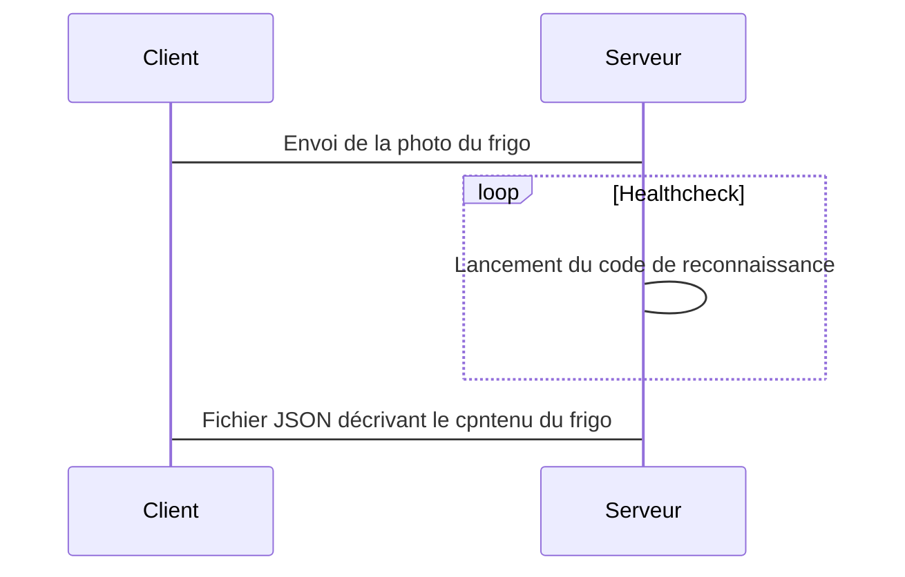

# Projet 1 Groupe 3 : Analyse ton frigo !
Services IA Cloud pour Robots et/ou Zoo

Auteurs : Leconte Thibault - Patole Elie - Ramadour Lucas

# Présentation du projet 
Objectif : Développer un service de reconnaissance d'objets ou d’interprétations associées à de l'IA
Service permettant renseigner la composition de son frigo (Lait, Beurre, ...)

# Listes des fonctionnalités :

1. [x] Entrainement de réseau de neurone (via les technologies Yolo/Darknet)
    1. Apprentissage de notre propre dataset
    2. Amélioration du dataset Coco déjà existant
2. [x] Développement d'un serveur web Flask permettant de bénéficier du service reconnaissance d'objet Darknet
    1. Version IPYNB pour déployer le serveur sur Google Collab
    2. Dockerfile pour lancer le serveur sur n'importe quelle machine
    3. Différents Endpoints (différentes méthodes d'appel API : méthode GET, POST, etc)
3. [x] Développement d'une partie client permettant l'accès au serive de reconnaissance d'objet Darkent
    1. Version IPYNB pour déployer le client sur Google Collab
    2. Application smartphone React-Native avec Expo (en Javascript)
    3. Appels d'API python pour accéder aux endpoints du service
    4. Appels d'API Javascript pour accéder aux endpoints du service
4. [x] Fonctionnalités incomplètes (encore en développement ...)
    1. Un exemple d'implémentation de l'API dans une App Naoqi
    2. Intégration ESP32
    3. Intégration ROS

# Description de l'algo

# Vidéos de présentation

[Lien vers la vidéo pitch youtube](url)

[Lien vers la vidéo tutoriel youtube](url)

# Liste des dépendances et pré-requis

- a
- b

# Procédure de mise en route

- a
- b
- n