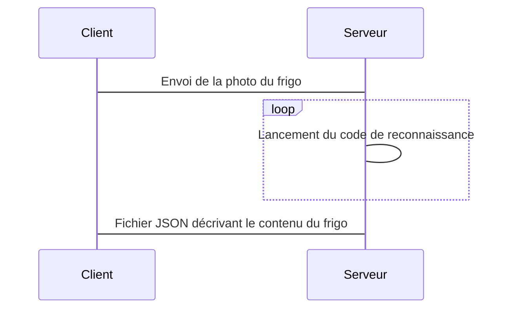

## Projet 1 Groupe 3 : Analyse ton frigo !
Services IA Cloud pour Robots et/ou Zoo

Auteurs : Leconte Thibault - Patole Elie - Ramadour Lucas

# Présentation du projet 
Objectif : Développer un service de reconnaissance d'objets ou d’interprétations associées à de l'IA  
Service permettant renseigner la composition de son frigo (Lait, Beurre, ...)

# Listes des fonctionnalités :

1. [x] Entrainement de réseau de neurone (via les technologies Yolo/Darknet)
    1. Création et labélisation de notre propre dataset d'images
    2. Entrainement du réseau de neuronne à partir d'un fichier poids Yolov3 tiny déjà existant  
  
2. [x] Développement d'un serveur web Flask permettant de bénéficier du service reconnaissance d'objet Darknet
    1. Version IPYNB pour déployer le serveur sur Google Colab
    2. Dockerfile pour lancer le serveur sur n'importe quelle machine
    3. Différents Endpoints (différentes méthodes d'appel API : méthode GET, POST, etc)  
  
3. [x] Développement d'une partie client permettant l'accès au service de reconnaissance d'objets Darknet
    1. Version IPYNB pour déployer le client sur Google Colab
    2. Application smartphone React-Native avec Expo (en Javascript)
    3. Appels d'API python pour accéder aux endpoints du service
    4. Appels d'API Javascript pour accéder aux endpoints du service  
  
4. [x] Fonctionnalités incomplètes (encore en développement ...)
    1. Un exemple d'implémentation de l'API dans une App Naoqi
    2. Intégration ESP32
    3. Intégration ROS  

# Description de l'algo

# Vidéos de présentation

[Lien vers la vidéo pitch youtube](url)

[Lien vers la vidéo tutoriel youtube](url)

# Liste des dépendances et pré-requis

1. Installation de Docker
    - Linux : "sudo apt install docker.io" (les commandes seront probablement toutes a exécuter avec "sudo")
    - Windows : suivre tuto (https://docs.docker.com/docker-for-windows/install/)
    - Commande afin de tester la bonne installation de Docker : "docker run hello-world"  

2. Installation de Node Js  
    - Linux : "sudo apt install nodejs-legacy"
    - Windows : https://nodejs.org/fr/download/
  
3. Installer l'application smartphone "Expo" depuis l'App Store ou Google Play Store  
  
4. Clone du repo git : "https://gitlab.com/20-21_5ETI_PRJ/Sujet_1__AI_Cloud_services/s1_g3_leconte_patole_ramadour.git"  
  
5. Installation de Ngrok
    - Linux : "sudo snap install ngrok"
    - Windows : suivre tuto (https://ngrok.com/download)  

# Procédure de mise en route

1. "git pull" du repo (potentielles mises jour)  
  
2. Dans un terminal, se placer dans le dossier "Docker" du repo git :
    - Entrer la commande "(sudo) docker build -t monserveurdocker ." permettant le build de notre container Docker  
    ( /!\ Attention le container fait 1Go et le build est assez long /!\ )  
    - Une fois le build terminé, entrer la commande "(sudo) docker run -p 80:80 monserveurdocker"  
    Voilà le serveur est en fonctionnement :)   
    Pour vérifier son bon fonctionnement vous pouvez ouvrir la page "localhost" de votre navigateur, et le message "Hello world !" doit apparaitre.  
  
3. Dans un autre terminal, se placer dans le dossier où le fichier nrgrok.exe (que vous avez téléchargé précédemment) se trouve,  
    - Puis entrer la commande : "nrgrok(.exe) http 80"  
    - Récupérer l'URL fournie par ngrok de la forme : "https://xxxxxxxxxxxxxxx.ngrok.io"  
    - Copier-coller la dans le fichier "App.js" (du dossier "ProjetApp") à la ligne 101 de la façon suivante :  
        "https://xxxxxxxxxxxxxxx.ngrok.io/recognition"  (puis enregistrer)
  
4. Dans un dernier terminal, se placer dans le dossier "ProjetApp" du repo git :
    - Entrer la commande : "npm install expo-cli"
    - Puis la commande :"npm install"
    - Enfin la commande : "npm start"  
  
5. Maintenant un QR-code doit apparaitre sur votre écran, scannez le : 
    ( /!\ Attention votre ordinateur et votre smartphone doivent être connectés sur le même réseau local /!\ )  
    Vous serez redirigés vers l'application Expo (L'application prend quelques secondes a s'initialiser)  
    Et voila :) Vous pouvez utiliser notre service de reconnaissance d'objets pour votre frigo, en suivant les instructions de l'application Smartphone  
    (Soyez patients la reconnaissance est parfois lente :) )  
